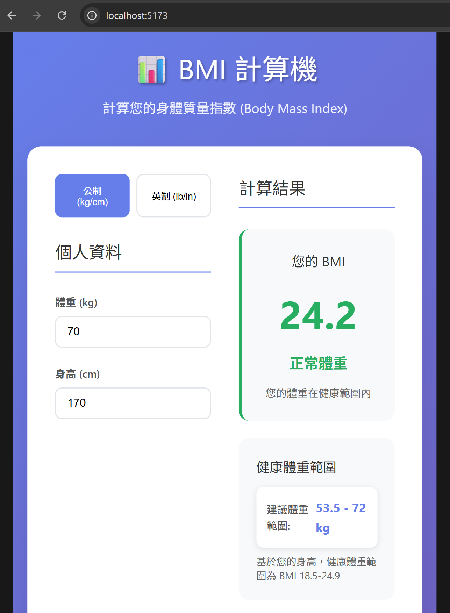

# 📊 BMI 計算機 (BMI Calculator)

一個基於 Vue 3 的現代化 BMI 計算機應用程式，幫助用戶計算身體質量指數並了解健康體重範圍。

## ✨ 功能特色

- **精確的 BMI 計算**: 支援公制 (kg/cm) 和英制 (lb/in) 單位
- **即時分類**: 自動顯示 BMI 分類和健康狀態
- **健康體重範圍**: 根據身高計算建議的健康體重範圍
- **視覺化分類**: 色彩區分的 BMI 分類標準
- **響應式設計**: 完美支援桌面和行動裝置
- **現代化 UI**: 美觀的漸層背景和卡片式設計

## 🚀 快速開始

### 安裝依賴
```bash
npm install
```

### 啟動開發伺服器
```bash
npm run dev
```

### 建置生產版本
```bash
npm run build
```
### 應用程式截圖



## 📊 BMI 分類標準

| BMI 範圍 | 分類 | 健康狀態 |
|---------|------|----------|
| < 18.5 | 體重過輕 | 體重低於正常範圍 |
| 18.5 - 24.9 | 正常體重 | 體重在健康範圍內 |
| 25.0 - 29.9 | 體重過重 | 體重略高於正常範圍 |
| 30.0 - 34.9 | 肥胖 (第一級) | 體重明顯高於正常範圍 |
| 35.0 - 39.9 | 肥胖 (第二級) | 體重嚴重高於正常範圍 |
| ≥ 40.0 | 肥胖 (第三級) | 體重極度高於正常範圍 |

## 🧮 計算公式

### 公制 (國際單位)
```
BMI = 體重(kg) ÷ 身高(m)²
```

### 英制 (美制單位)
```
BMI = 體重(lb) × 703 ÷ 身高(in)²
```

## 🎯 主要功能

### 1. 單位切換
- 支援公制 (kg/cm) 和英制 (lb/in) 單位
- 自動轉換數值並重新計算

### 2. BMI 計算
- 即時計算 BMI 數值
- 顯示到小數點後一位

### 3. 健康評估
- 自動分類 BMI 結果
- 提供健康狀態描述
- 計算建議的健康體重範圍

### 4. 視覺化顯示
- 色彩區分的 BMI 分類
- 當前分類高亮顯示
- 完整的 BMI 分類標準表

## 🛠️ 技術棧

- **Vue 3**: 使用 Composition API 和 `<script setup>` 語法
- **Vite**: 快速的建置工具
- **CSS Grid & Flexbox**: 現代化的佈局技術
- **響應式設計**: 支援各種螢幕尺寸

## 📱 使用方式

1. 選擇單位系統 (公制或英制)
2. 輸入您的體重和身高
3. 查看計算結果和 BMI 分類
4. 了解健康體重範圍建議
5. 參考 BMI 分類標準

## 🎨 設計特色

- 漸層背景設計
- 卡片式佈局
- 色彩區分的 BMI 分類
- 平滑的動畫效果
- 直觀的用戶界面
- 響應式設計

## ⚠️ 重要提醒

### BMI 的局限性
- BMI 不考慮肌肉量、骨骼密度、年齡和性別差異
- 不適用於運動員、孕婦、兒童和老年人
- 僅供一般健康評估參考

### 建議
- 此計算機提供的結果僅供參考
- 建議諮詢專業醫生或營養師以獲得準確的健康評估
- 結合其他健康指標進行綜合評估

## 📄 授權

MIT License

## 🤝 貢獻

歡迎提交 Issue 和 Pull Request！

---

**注意**: BMI 計算機提供的建議僅供參考，實際的健康狀況評估應諮詢專業醫療人員。
